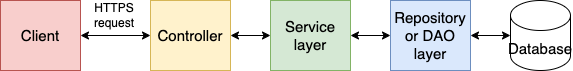

# 2. Use Spring Boot 3-tier service architecture

Date: 2024-11-25

## Status

Accepted

## Context

We desire a standard application structure which enables the service to remain a microservice and satisfies separation 
of concerns. 

The aim is to simplify the learning curve for new devs by following industry standard conventions. 

Spring Boot does not enforce a specific architecture, but it is often used in a 3-tier architecture.

## Decision

Use Spring Boot and choose 3-tier service architecture conventions.

This includes separation of concerns regarding controller (API presentation) layer, service (business logic, or placeholder
if none) layer, repository (data access logic, extending CRUD) layer.

Objects should use an internal model which is transformed into a client model or database model representing valid JSON 
at a client or database boundary.

## Consequences

Upgrading between Spring Boot versions or migrating to another framework (if such an action is desired in the future) 
can be complex and time-consuming.

Spring Boot offers a selection of "starter" dependencies which simplifies popular capabilities such as database support, web 
development, and messaging.

"Convention over configuration" tenet makes certain assumptions about the application setup. This must be actively 
checked for during code review as does not form a part of checkstyle automated checks.

Spring Boot includes embedded server, eg. Tomcat, which enables standalone JAR deployment.

Spring Boot has several features that are ready for production, including metrics, health checks, and externalized 
configuration which simplifies for monitoring.